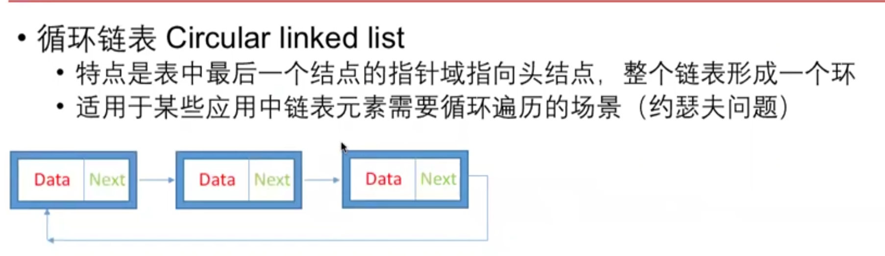

# Sort

[https://www.cs.usfca.edu/\~galles/visualization/ComparisonSort.html](https://www.cs.usfca.edu/\~galles/visualization/ComparisonSort.html)

> 排序
>
> Example
>
> ```
> Example 1:
> 	Input:  [3, 2, 1, 4, 5]
> 	Output: [1, 2, 3, 4, 5]
> 	
> 	Explanation: 
> 	return the sorted array.
>
> Example 2:
> 	Input:  [1, 1, 2, 1, 1]
> 	Output: [1, 1, 1, 1, 2]
> ```

选择排序（Selection sort）:

```
public void sortIntegers(int[] A) {
        for(int i = 0; i < A.length; i++){
            for(int j = i + 1; j < A.length; j++){
                if(A[i] > A[j]) {
                    int tmp = A[i];
                    A[i] = A[j];
                    A[j] = tmp;
                }
            }
        }
    }
```

插入排序（Insertion sort）:

```
public void sortIntegers(int[] A) {
        for(int i = 0; i < A.length; i++){
            int val = A[i];
            int j = i - 1;
            while(j >= 0 && A[j] >= val){
                A[j + 1] = A[j];
                j--;
            }
            A[j + 1] = val;
        }
    }
```

冒泡排序（Bubble sort）:

```
public void sortIntegers(int[] A) {
        while (true) {
            boolean exchange = false;
            for (int i = 0; i < A.length - 1; i++) {
                if (A[i] > A[i + 1]) {
                    int tmp = A[i];
                    A[i] = A[i + 1];
                    A[i + 1] = tmp;
                    exchange = true;
                }
            }
            if (!exchange) {
                break;
            }
        }
    }
```

归并排序（merge sort）

– 把数组均分成左右两半&#x20;

– 将左右两半分别排序（递归）&#x20;

– 将排好序的两半数组合并（merge）




快速排序（quick sort）

– 把数组分为两边，使得：数组的左边小于等于数组的右边（左右两边长度 不一定相等）

&#x20;– 对左右两部分数组分别排序（递归）

partition边界 一定是\[left, j] \[i, right]

.png>).png>)

